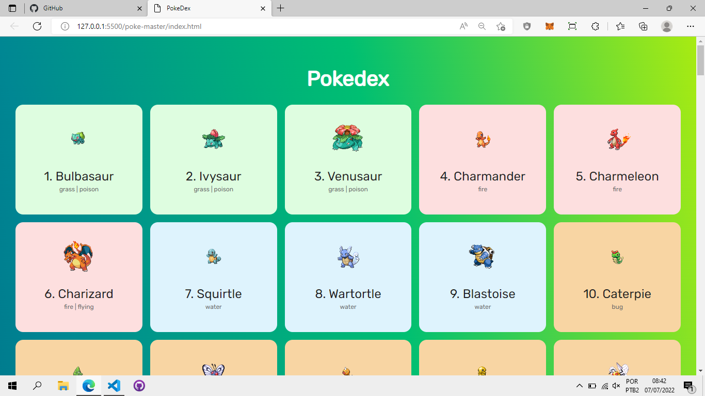
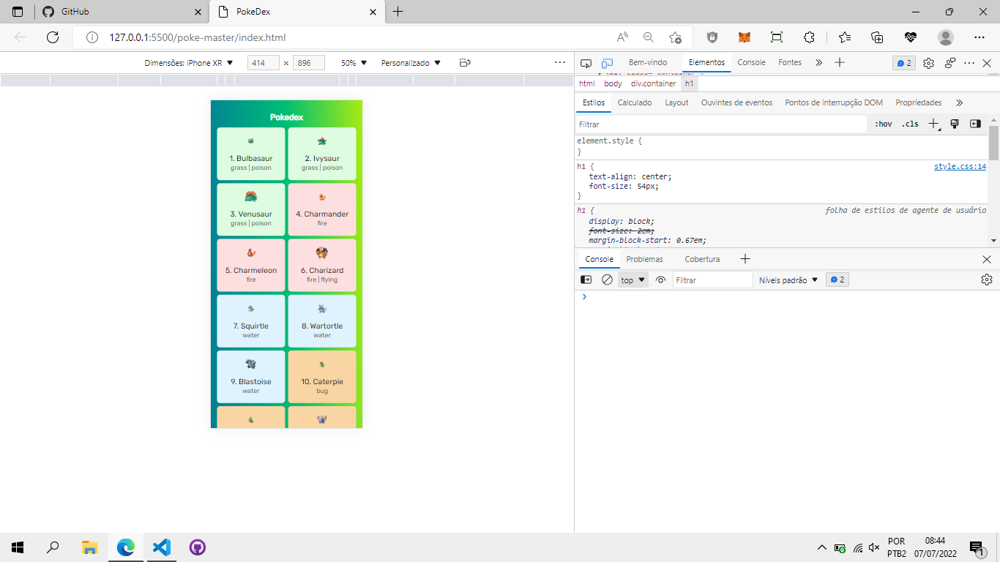

# Pokedex

> Resultado do projeto Pokedex.

### Sobre

O projeto se trata de uma pokedex com 150 pokemons, usando uma API, foi usado:

- [x] HTML
- [x] CSS
- [x] Responsividade
- [x] JAVASCRIPT
- [x] API

## 🤝 Colaboradores

Agradecemos às seguintes pessoas que contribuíram para este projeto:

<table>
  <tr>
    <td align="center">
      <a href="#">
         
        
          <b>Vagner Santos</b>
        
      </a>
    </td>
  </tr>
</table>

